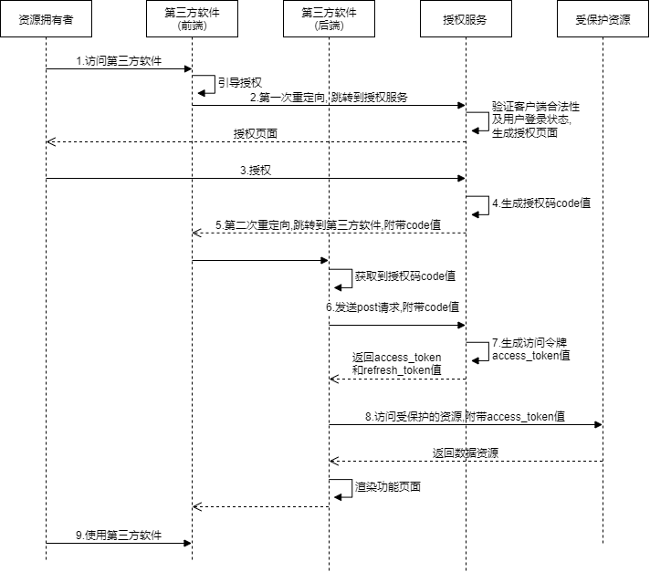

[TOC]

# OAuth 2.0 实战

## 1.什么是 OAuth 2.0

> 摘自: https://oauth.net/2/
>
> > OAuth 2.0 is the industry-standard protocol for authorization. OAuth 2.0 focuses on client developer simplicity while providing specific authorization flows for web applications, desktop applications, mobile phones, and living room devices. This specification and its extensions are being developed within the [IETF OAuth Working Group](https://www.ietf.org/mailman/listinfo/oauth).

OAuth 2.0 是业界标准的授权协议

### 1.1 access token

唯一性, 不可连续性, 不可猜测性.
关于结构化令牌, 目前使用最多的是 JWT.

#### 什么是JWT?

根据[官方文档](https://datatracker.ietf.org/doc/html/rfc7519)的描述, JSON Web Token(JSON Web Token)是一个开放标准(RFC 7519),它定义了一种紧凑的、自包含的方式,用于作为 JSON 对象在各方之间安全地传输信息. 简单来说,JWT 就是用一种结构化封装的方式来生成 token 的技术.
因为JSON的通用性,所以JWT是可以进行跨语言支持的,JAVA,JavaScript,NodeJS,PHP等很多语言都可以使用.

JWT这种结构化体分为三部分:

- HEADER(头部)
  - 表示装载令牌类型和算法等信息,是 JWT 的头部. typ 表示第二部分 PAYLOAD 的类型,alg 表示使用的签名算法.
- PAYLOAD(数据体)
  - sub (subject)：令牌的主体, 一般设为资源拥有者的唯一标识
  - exp (expiration time)：令牌的过期时间
  - iat (Issued At)：令牌颁发的时间
  - iss (issuer)：签发者
  - aud (audience)：接收jwt的一方
  - nbf (Not Before)：生效时间(定义在什么时间之前,该jwt都是不可用的)
  - jti (JWT ID)：编号(jwt的唯一身份标识,主要用来作为一次性token,从而回避重放攻击)
  - 除了官方字段, 还可以定义私有字段(一个JWT内可以包含一切合法的JSON格式数据), JWT 默认是不加密的,任何人都可以读到,所以不要把秘密信息放在这个部分.
- SIGNATURE(签名)
  - 表示对JWT的签名, signature部分是对前两部分的加密签名, 防止数据篡改. 当受保护资源接收到第三方软件的签名,需要验证令牌的签名是否合法.
  - SIGNATURE的生成, 需要指定一个密钥secret, 存于服务端, 然后使用header中指定的签名算法, 比如HMAC SHA256, 按照公式`HMACSHA256(header (base64后的) + "." +payload (base64后的), secret)`生成签名.

经过签名后的JWT整体结构: header.payload.signature     (其中header和payload都是base64加密后的)

注意点: (1)payload部分部分是客户端可以解密的,所以不要存放敏感信息.(2)保护好secret私钥.(3)建议使用https协议.

[JWT在线校验工具](https://jwt.io/)


流程摘自RFC 6749: [Protocol Flow](https://datatracker.ietf.org/doc/html/rfc6749#section-1.2)


## 2.授权类型

- 授权码模式(Authorization Code Grant)
- 隐式授权(Implicit Grant)
- 密码模式(Resource Owner Password Credentials Grant)
- 客户端授权模式(Client Credentials Grant)

### 2.1授权码模式(Authorization Code Grant)

授权码许可类型序列图:



在 OAuth 2.0 中，访问令牌被要求有极高的安全保密性，因此我们不能让它暴露在浏览器上面，只能通过第三方软件的后端服务来获取和使用，以最大限度地保障访问令牌的安全性。正因为访问令牌的这种安全要求特性，当需要前端通信，比如浏览器上面的流转的时候，OAuth 2.0 才又提供了一个临时的凭证：授权码。通过授权码的方式，可以让用户在授权服务上给第三方软件授权之后，还能重新回到第三方软件的操作页面上。这样，在保障安全性的情况下，提升了用户在第三方软件上的体验。

```
Q1: 授权码被盗取后, 不能模拟服务器请求获取 access_token 吗? 如果把令牌暴露在前端会带来怎样的后果呢?
A1: 一方面授权码也都有有效期，另外一方面除非再盗取了第三方应用软件的app_id、secret才能成功请求资源.
也有授权许可是通过前端传输, 比如隐式许可, 但它是非常不安全的许可类型, 我们强调 OAuth 2.0的核心是令牌, 安全性是一个"组合性"问题, 单个信息暴露在公网一时是没有直接的问题, 比如用户手机号被人知道一般是被骚扰, 但是如果黑产拿到跟这个手机号更多关联的信息, 比如订单信息, 这个时候用户就会有被恶意诈骗的可能.

Q2: 如果使用HTTPS是不是可以不使用授权码, 也能保证安全了?
A2: HTTPS 和 OAuth 是两个维度的安全，HTTPS解决的信息加密传输，OAuth 解决的是用token来代替用户名和密码传输.

Q3: 对于本地登录来说, 是否可以套用OAuth2.0, 需要做哪些方面的变通? 又或者, 是否有更合适的协议呢?
A3: OAuth 2.0 产生于第三方应用的场景，来管理对外的权限，但是它的本质思想是"用token来代替用户名和密码"。
对于我们内部的系统服务之间，我们可以借用 OAuth 2.0的这种思想来满足我们的生产环境，比如微服务之间调用需要进行鉴权的时候，我们就可以使用这种token的机制。
```


### 注意事项

- 在服务端对输入数据的请求，都尽可能做一次合法性校验
- 授权服务是整个 OAuth 2.0 体系中的灵魂组件, 任何一种许可类型都离不开它的支持, 它也是最复杂的组件. 授权服务的核心是先颁发授权码 code 值, 再颁发访问令牌 access_token 值. 在颁发访问令牌的同时还会颁发刷新令牌 refresh_token 值, 这种机制可以在无须用户参与的情况下用于生成新的访问令牌.
- 注意授权范围, 不能让第三方软件获得比注册时权限范围还大的授权, 也不能获得超出了用户授权的权限范围, 始终确保最小权限安全原则.


## 参考文章
- https://oauth.net/2/
- https://datatracker.ietf.org/doc/html/rfc6749 (The most important)
- https://www.ruanyifeng.com/blog/2014/05/oauth_2_0.html
- https://projects.spring.io/spring-security-oauth/docs/oauth2.html
- https://blog.didispace.com/spring-security-oauth2-xjf-1/
- https://blog.csdn.net/qq_37771475/article/details/103288957
- https://time.geekbang.org/column/intro/100053901
- Abort JWT:
  - https://datatracker.ietf.org/doc/html/rfc7519
  - https://www.ruanyifeng.com/blog/2018/07/json_web_token-tutorial.html
  - https://www.jianshu.com/p/576dbf44b2ae

