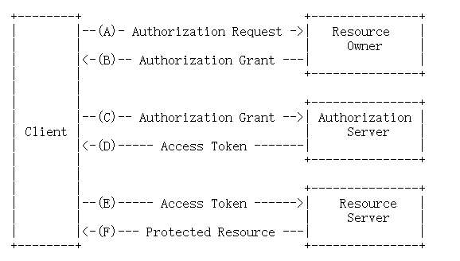

[TOC]

# OAuth 2.0 实战

## 1.什么是 OAuth 2.0

> 摘自: https://oauth.net/2/
>
> > OAuth 2.0 is the industry-standard protocol for authorization. OAuth 2.0 focuses on client developer simplicity while providing specific authorization flows for web applications, desktop applications, mobile phones, and living room devices. This specification and its extensions are being developed within the [IETF OAuth Working Group](https://www.ietf.org/mailman/listinfo/oauth).

OAuth 2.0 是业界标准的授权协议

### 1.1 OAuth角色

OAuth 定义了四种角色:

- resource owner: 资源所有者(用户)
- resource server: 资源服务器
- client: 客户端(第三方应用)
- authorization server: 授权服务器

### 1.2 access token

access token 具有唯一性, 不可连续性, 不可猜测性.
关于结构化令牌, 目前使用最多的是 JWT.

- [JWT](./JWT.md)

流程摘自RFC 6749: [Protocol Flow](https://datatracker.ietf.org/doc/html/rfc6749#section-1.2)

### 注意事项

- 在服务端对输入数据的请求，都尽可能做一次合法性校验
- 授权服务是整个 OAuth 2.0 体系中的灵魂组件, 任何一种许可类型都离不开它的支持, 它也是最复杂的组件. 授权服务的核心是先颁发授权码 code 值, 再颁发访问令牌 access_token 值. 在颁发访问令牌的同时还会颁发刷新令牌 refresh_token 值, 这种机制可以在无须用户参与的情况下用于生成新的访问令牌.
- 注意授权范围, 不能让第三方软件获得比注册时权限范围还大的授权, 也不能获得超出了用户授权的权限范围, 始终确保最小权限安全原则.

第三方软件应用需要关注的内容:

- 注册信息: 第三方软件需要去授权服务器注册信息,获取app_id和app_secret等信息,填写回调地址redirect_uri、申请权限等;
- 引导授权
- 使用访问令牌
- 使用刷新令牌

受保护资源服务需要关注的内容:

- 检查令牌合法性

- 权限范围: 权限类别有以下几种

  - 不同的权限对应不同的操作

  - 不同的权限对应不同的数据

  - 不同的用户对应不同的资源

    有很多受保护资源服务,应该有一个统一的网关层来处理权限的校验.

## 2.授权类型

- 授权码模式(Authorization Code Grant)
- 密码模式(Resource Owner Password Credentials Grant)
- 客户端授权模式(Client Credentials Grant)
- 隐式授权(Implicit Grant)

### 2.1授权码模式(Authorization Code Grant)

授权码许可. grant_type为: authorization_code.

授权码模式概括起来就两步,第一步是获取授权码code,第二步是用app_id+app_secret+code获取访问令牌access_token.

序列图:

在 OAuth 2.0 中，访问令牌被要求有极高的安全保密性，因此我们不能让它暴露在浏览器上面，只能通过第三方软件的后端服务来获取和使用，以最大限度地保障访问令牌的安全性。正因为访问令牌的这种安全要求特性，当需要前端通信，比如浏览器上面的流转的时候，OAuth 2.0 才又提供了一个临时的凭证：授权码。通过授权码的方式，可以让用户在授权服务上给第三方软件授权之后，还能重新回到第三方软件的操作页面上。这样，在保障安全性的情况下，提升了用户在第三方软件上的体验。

#### Q & A
- 
  - Q1: 授权码被盗取后, 不能模拟服务器请求获取 access_token 吗? 如果把令牌暴露在前端会带来怎样的后果呢?
  - A1: 一方面授权码也都有有效期，另外一方面除非再盗取了第三方应用软件的app_id、secret才能成功请求资源.
    也有授权许可是通过前端传输, 比如隐式许可, 但它是非常不安全的许可类型, 我们强调 OAuth 2.0的核心是令牌, 安全性是一个"组合性"问题, 单个信息暴露在公网一时是没有直接的问题, 比如用户手机号被人知道一般是被骚扰, 但是如果黑产拿到跟这个手机号更多关联的信息, 比如订单信息, 这个时候用户就会有被恶意诈骗的可能.
- 
  - Q2: 如果使用HTTPS是不是可以不使用授权码, 也能保证安全了?
  - A2: HTTPS 和 OAuth 是两个维度的安全，HTTPS解决的信息加密传输，OAuth 解决的是用token来代替用户名和密码传输.
- 
  - Q3: 对于本地登录来说, 是否可以套用OAuth2.0, 需要做哪些方面的变通? 又或者, 是否有更合适的协议呢?
  - A3: OAuth 2.0 产生于第三方应用的场景，来管理对外的权限，但是它的本质思想是"用token来代替用户名和密码"。
    对于我们内部的系统服务之间，我们可以借用 OAuth 2.0的这种思想来满足我们的生产环境，比如微服务之间调用需要进行鉴权的时候，我们就可以使用这种token的机制。

#### 适用场景

在所有授权类型中,授权码模式是安全性最高的.因此,只要是具备使用授权码许可类型的条件,首选授权码许可类型.

### 2.2 密码模式(Resource Owner Password Credentials Grant)

资源拥有者凭证许可. 所谓资源拥有者的凭证,就是用户名和密码. grant_type为: password.

序列图

#### 适用场景

一般用于第三方软件是服务官方出品, 同一个企业内部的不同产品,

### 2.3 客户端授权模式(Client Credentials Grant)

客户端凭证许可. grant_type为: client_credentials.

序列图

#### 适用场景

如果没有明确的资源拥有者,比如某个LOGO的图片地址,比如平台提供的省市区信息,这些不属于任何一个第三方用户.这种场景下的授权,第三方软件可以直接使用app_id和app_secret来获取访问令牌.

### 2.4 隐式授权(Implicit Grant)

隐式许可.又称简化授权模式.它和授权码模式相似,只不过少了获取授权码的步骤,是直接获取令牌access_token的,且没有refresh_token.  因为使用授权码的目的之一是把浏览器和第三方软件的信息隔离,确保浏览器看不到第三方软件的access_token值. 隐式许可适用于第三方应用没有后端服务只是在浏览器里面执行的,这种情况下,第三方软件对于浏览器没有任何保密的数据可以隐藏,所以不需要app_secret,也不需要通过授权码code来换取访问令牌access_token.

安全性低.

序列图

#### 适用场景

适用于公开的浏览器单页应用,只嵌入到浏览器端且没有服务端的应用,以及没有server的APP应用.

### 2.5 四种授权模式的对比

|  授权许可类型    |  获取访问令牌的方式    |
| ---- | ---- |
|  授权码许可    |  通过授权码code获取access_token    |
|  资源拥有者凭证许可    |  通过资源拥有者的用户名和密码获取access_token    |
|  客户端凭证许可    |  通过第三方软件的app_id和app_secret获取access_token    |
|  隐式许可    |  通过嵌入浏览器中的第三方软件的app_id获取access_token    |

### 2.6 APP中使用OAuth 2.0

以上时序图画的都是基于web端应用,对于APP应用,OAuth 2.0一样使用. APP应用可分为两类:一类是有server端的APP应用,一类是没有server端的APP应用.

对于没有server端的APP应用,该如何使用授权码许可类型呢?

没有server端的APP应用使用授权码许可类型,需要解决的问题:APP被安装到终端设备,请求访问令牌时需要的app_secret只能保存在本地,app_secret一旦被破解,将造成灾难性后果.

OAuth 2.0中的指导方法: Proof Key for Code Exchange([PKCE协议](https://oauth.net/2/pkce/))

## 参考文章
- https://oauth.net/2/
- https://datatracker.ietf.org/doc/html/rfc6749
- https://www.ruanyifeng.com/blog/2014/05/oauth_2_0.html
- https://projects.spring.io/spring-security-oauth/docs/oauth2.html
- https://blog.didispace.com/spring-security-oauth2-xjf-1/
- https://blog.csdn.net/qq_37771475/article/details/103288957
- https://time.geekbang.org/column/intro/100053901
